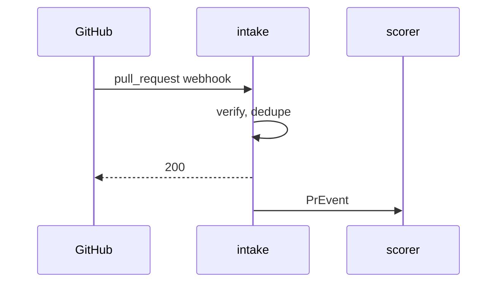

Diagrams in these docs are written as [Mermaid](https://mermaid.js.org/intro/),
a text syntax most engineers already know. Write the diagram in the page's
markdown; the site draws it at build time in its own type, colours and theme.
The same source renders on GitHub, so a diagram reads correctly wherever the
markdown is opened.

## Write one

Use a fenced block with the language `mermaid`. An optional first line,
`%% caption: ...`, sets the figure's caption and its accessible name. It is a
Mermaid comment, so GitHub and other renderers ignore it.

````md

````

That block renders as:


## Supported diagram types

| Type | Opens with | Use it for |
| --- | --- | --- |
| Flowchart | `graph LR` or `graph TD` | Services, data flow, decisions |
| Sequence | `sequenceDiagram` | Requests between services over time |
| State | `stateDiagram-v2` | Lifecycles, such as a label maturing |
| Class | `classDiagram` | Shapes of contracts and records |
| Entity relationship | `erDiagram` | Tables and their keys |
| XY chart | `xychart-beta` | A line or bar over one axis |

Anything else fails the build with the diagram's caption in the error, so a
broken diagram never ships as an empty box.

## Rules

- **Draw nothing that is not in the text.** A diagram summarises a page; it
  never carries a claim the prose does not make.
- **Label charts that are not data.** A curve that shows a shape rather than
  measurements says so in its caption.
- **Leave colour to the theme.** Do not use `style`, `classDef` or `linkStyle`
  to set colours. The site maps every diagram onto the light and dark themes,
  and a hard-coded colour breaks one of them.
- **Prefer `LR` for pipelines and `TD` for hierarchies.** Keep a diagram to
  about eight nodes; past that, split it.
- **Dashed edges mean optional.** Use `-.->` for a path that is allowed to
  fail, such as the explainer.

## How it works

At build time each block is rendered to SVG with
[beautiful-mermaid](https://github.com/lukilabs/beautiful-mermaid), which lays
out the diagram without a browser. Its colours are the docs' CSS variables, so
switching between light and dark repaints the diagram with no script. Under
every diagram, **Mermaid source** shows the text it was drawn from.
